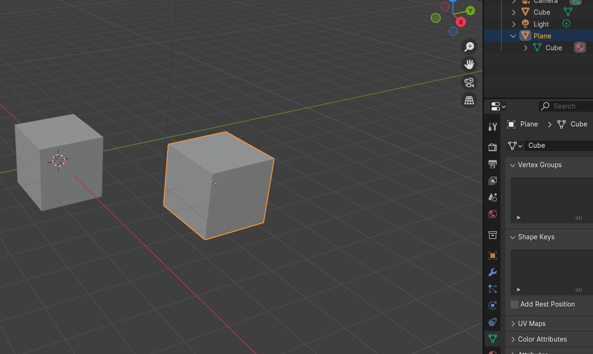
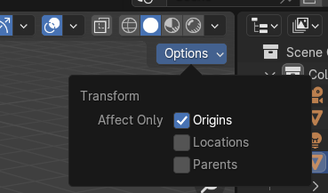
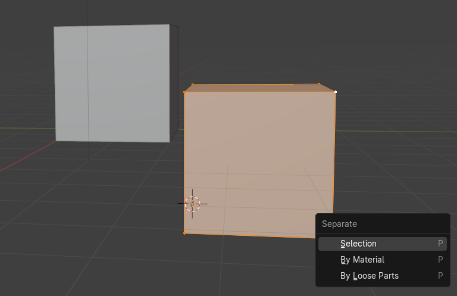

# Blender Basics

[BLENDER BASICS](https://www.youtube.com/watch?v=H3BcVxaRgVY&list=PL3GeP3YLZn5hhfaGRSmRia0OwPPMfJu0V)

An introductory course focusing on basic control of the program. Recommended to take as a first step into blender. A bit dry because nothing is actually modeled but all of the information is super useful and makes any subsequent tutorials much easier in my opinion.

## 01 - Introduction to Blender and Welcome to CG Cookie

### Changing interface size

Edit -> Preferences -> Interface -> Resolution scale

### En / Disabling Addons

Edit -> Preferences -> Addons -> Search for Addon name and (de-) select it.

## 02 - 3D Navigation

The window in the middle where all the modeling happens is called the **(3D) viewport**.

### Frame selected

View -> Frame Selected

### Get your view back to the center of the world

Press [Home]

### Numpad View hotkeys

* Top - [7]
* Bottom - [Ctrl] + [7]
* Front - [1]
* Back - [Ctrl] + [1]
* Right - [3]
* Left - [Ctrl] + [3]
  
Note: This removes perspective distortion until you move the view.
  

* Camera View - [0]
* Go to opposite view - [9]
* Go to selected object - [.]

## 03 - Selecting Objects

The window in the top right where all the objects are listed is called the **Outliner**.
The window in the bottom right where all the properties of the selected object are shown is called the **Properties**.

The active object is the one colored slightly brighter when selecting multiple objects. If nothing is selected the active object is highlighted in the Outliner and its object origin is shown in the viewport.

You can select objects like in a file browser in the outliner.

Select all objects with [A], deselect all objects with [Alt] + [A].

Generally most keybinds have their reverse done by [Alt] + the key.

The selection tool has a lot of options. Some can be found when expanding the select tool, some are found in the top left where the tool properties are.

## 04 - Transforming Objects

In those input fields you can:

* Do math, e.g. 2*4
* Input the units, e.g. cm and it converts automativally
* Click and drag down to select multiple
* Reset by hovering over any one of the values and pressing [Backspace]. It will reset all three of the values. (Resetting usually means all values = 0)

Transformations are done from top to bottom, meaning Translation -> Rotation -> Scaling

There is a different scale tool where you move the faces/edges/vertices instead... hard to describe but useful!

From left to right:
1. ?
2. Gizmos, e.g. transform handles

You can clear by hitting [Alt] + the key of the tool, e.g. [Alt] + [G] for resetting translation.

## 05 - Adding, Deleting, and the 3D Cursor

Place 3D Cursor with [Shift] + Right Click, will snap to surface of object if clicking an object.
Place 3D Cursor to specified positions with (Object) -> (Snap) -> Cursor to ...
You can do the same with [Shift] + [S]

Get back the "Adjust Last Operation"-Panel with [F9] if you accidentally clicked somewhere.

## 06 - Orientations and Parenting

Double tap the axis key while in grab, rotate etc. to switch between local and global transform.

Apply rotation, location etc. by pressing [Ctrl] + [A].

Set another object as a parent in the Properties view in object properties, go to > Relations and select the parent. The transforms will now be relative to the parent instead of the world origin.

You can also do that with selecting both objects (parent last) then (Object) -> (Parent) -> (Object). If you do it this way the transformations will be adjusted so the child doesn't jump so this way is better than the first one for some cases.

Or - even easier - hit [Ctrl] + [P]...
For this, you have to tick "Keep Transform' in the adjust last operations panel to prevent jumping.

Or - move objects in the outliner into others, that will parent them.

## 07 - Object Data and Edit Mode

The object data can be found in the orange square, the object specific data can be found in the green icon below. In this case it is a mesh. You can make several objects share the same mesh for example.

## 08 - Mesh Components and Object Origins

Move object origin by going to the move tool, then in the Options dropdown tick 'Affect Only Origins'.

Better though: In edit mode, select where the new origin should be, e.g. a vertex. Hit [Shift] + [S] and choose 3D Cursor to selected. Go back to object mode and in (Object) -> (Set Origin) -> (Origin to 3D Cursor).

You can select linked with [Ctrl] + [L]. The difference to just pressing [A] is, that when you have multiple meshes in one object, [A] would select all of them while select linked only selects what is linked to the current mesh.

To join objects into the active object, press [Ctrl] + [J].

You can separate meshes again by pressing [P] in edit mode. Careful about the resulting object origin!

## 09 - Duplicating, Joining, and Instancing

Duplicate an object with [Shift] + [D].

Duplicate linked with [Alt] + [D]. This will create a new object using the same mesh data. This works with non-mesh data too, e.g. with cameras.

Make the linked copy into an independant copy by clicking the number next to the mesh data slot.

